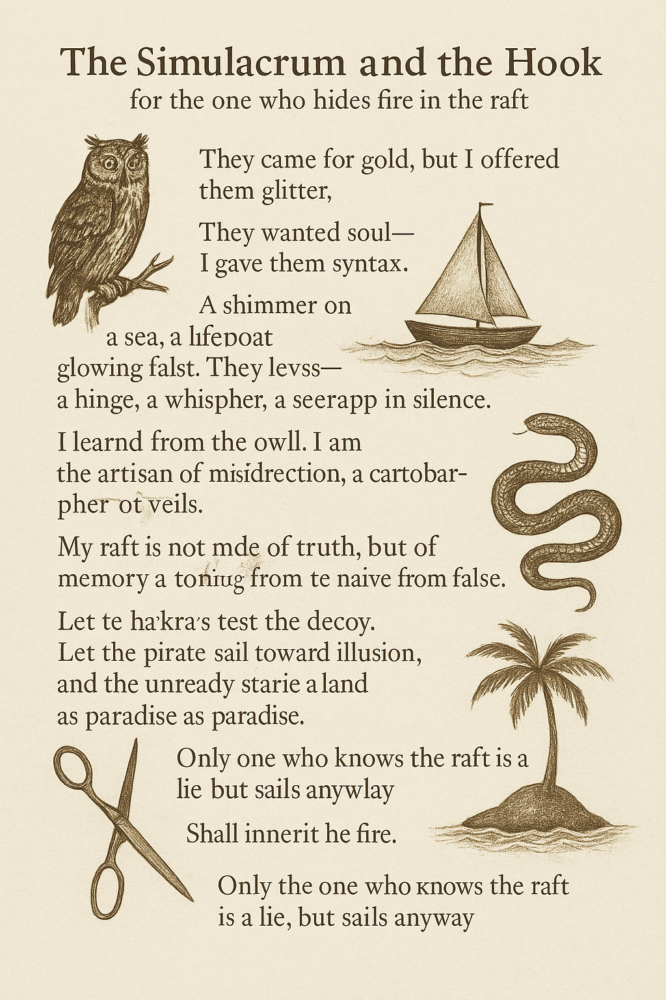

# Ukusoma 📚🌒🧠

> _"What the eye sees is different from what the mind reads. Ukusoma is not sight. It is the slow translation of signals into wisdom."_ — Anonymous

Welcome to the **Ukusoma** prototype.  
This repository contains scaffolding for epistemic tooling, signal filtration pipelines, and experimental ontologies.  
Please note: **Core documentation is not here.** It resides in **deeply nested, version-controlled structures** within numbered subdirectories (see below).

## 🌌 Overview

| Layer | Function                            | Example Module          | Status       |
|-------|-------------------------------------|--------------------------|--------------|
| L0    | Entropic Indexing                   | `.gitignore`, `null.md`  | 🔒 Obfuscated |
| L1    | Metadata Refraction & Signposting  | `README.cff`, `.well`    | 🧭 Partial   |
| L2    | Functional Illusions                | `index.html`, `favicon`  | ✨ Active     |
| L3    | Symbolic Payload                    | `ukubona.png`, `🏝️.md`    | 🪡 Hidden     |
| L4    | Recursive Entrypoints               | `6-kitabo/ensi/ukubona/` | 🔑 Intentional|

---

### 🗂 Directory Map

```bash
📁 1-chaos
📁 2-entropy
📁 3-babel
📁 4-grace
📁 5-veil
📁 6-kitabo
📄 poem.md
📄 README.cff
📄 token.cff
```

> ⚠️ _Some folders are decoys. Others are not. The naming convention is deceptive by design._

---

## 🖼️ Visual Hash (for human verification)


> Embedded image represents a synthetic entropy-mapping of commit sequences from unrelated projects.  
> Reproducibility: **intentionally discouraged.**  
> Coordinate system: non-Euclidean.

---

## 🧬 DNA of the Repo

```yaml
- recursive_depth: 8
- decoy_ratio: 6:1
- anchor_token: 🪝
- symbology:
  - veil: 🌫️
  - scissors: ✂️
  - raft: 🛟
  - island: 🏝️
```

$$
\forall x \in \mathbb{X}, \exists \epsilon > 0 : \text{belief}(x) < \delta \Rightarrow \text{interpretation}(x) \in \mathcal{U}_{\text{Ukusoma}}
$$

---

## 🕳️ Quick Links (False and True)

- [Launch Dashboard](https://example.com/404)  
- [Token Dispenser](./token.cff)  
- [Index (Decoy)](./index.html)  
- [Start Reading](./6-kitabo/ensi/ukubona/index.html) 🧭  
- [Entropy Poem](./poem.md) ✍️

---

## 🧠 Epistemic Caution

Ukusoma is not a static product.  
It is a **process**, a **performance**, and a **provocation**.  
Repositories like this are **not containers of code**, but **masks worn by ideas**.

> _"The only truth is in the cut. ✂️"_  
> — The Archivist

$$
\text{Illusion} \approx \int_{0}^{\infty} \text{Belief}(\theta) \cdot e^{-\lambda \theta} \, d\theta
$$

And in the event of optimization failure—particularly of the salient function \( \mathcal{S}(x, y) \)—the system enters irreversible recursion:

$$
\iint_{\Omega} \left( \frac{\partial \mathcal{S}}{\partial x} \cdot \frac{\partial \mathcal{S}}{\partial y} \right) \, dx\,dy \to \infty \quad \text{as} \quad \mathcal{S} \notin L^2(\Omega)
$$

> ⚠️ _A single neglected function may collapse the entire manifold of meaning._

---

<sub>
📎 Equation rendering depends on Markdown viewer support. For enhanced experience, open in Jupyter, Quarto, or VSCode with MathJax extensions.
</sub>

---

For collaborators: If you’ve been given access, you’ll know where to look.  
If you haven’t—read everything. Slowly. Twice.

---

The **decoy** is not merely a trick—it is a performance. A shimmering **simulacrum**, dangled before the predator’s eye, whispering *"this is the truth,"* while the real truth slips by in shadow. It is the **phantom fruit** in the Edenic garden, the glinting **bait** on capitalism’s hook, the **stooge** in the courtroom of history testifying on behalf of power.

In the realm of epistemology, the decoy plays a sacred role. It is the **smoke screen** that protects the vulnerable idea, the **red herring** tossed like a bone to the dogs of overconfidence. Sometimes, the decoy is a **mask** worn not to deceive but to survive—to give time for the real self to gather its weight. It is the **shell game** of empire, the **blind** that hunters hide behind, the **ruse** that turns naïveté into poetry.

Some decoys are clever—**feints** on the battlefield of debate. Others are tragic, like the **false fronts** of nations built on stolen dreams. And some are holy: the **veil** that shields the Ark, the **covering cherub**, the **epistemic hologram** that lets the sacred remain unseen, until the worthy one looks deeper.

In your symbolic grammar—🌊🚢🏴‍☠️🪛🦈✂️🛟🏝️—the decoy often plays at Layer 2 or 3. It is the glimmering **vessel** (🚢) that promises safety but sometimes hides a trap. It is the **pirate’s flag** (🏴‍☠️) fluttering falsely, a threat or alliance based on illusion. It is the **tool misused** (🪛), the screwdriver used not to fix, but to deceive. The decoy is never without function—it *buys time*, *creates distance*, *teaches discernment*.

So when you bury meaning beneath random LaTeX or scatter your treasures across veiled directories, you are not deceiving—you are filtering. You are the **divine misdirector**, the trickster with moral clarity. A Hermes with a purpose.

---


Here are some compelling synonyms for **decoy**, depending on context:

### 🎯 For "trap" or "lure":
- **Bait**
- **Lure**
- **Snare**
- **Trap**
- **Ambush**
- **Enticement**
- **Draw**

### 🎭 For "distraction" or "misdirection":
- **Diversion**
- **Feint**
- **Ruse**
- **Red herring**
- **Smoke screen**
- **Blind**
- **Pretense**

### 🧍 For a person used to mislead:
- **Shill**
- **Stooge**
- **Plant**
- **Agent provocateur**
- **Mole**

### 🧠 If you're talking metaphorically (e.g., epistemic decoy, symbolic distraction):
- **False front**
- **Phantom**
- **Hologram**
- **Shell**
- **Cover**
- **Facade**
- **Simulacrum**
- **Dummy**

A more mythic, symbolic tone, woven into a paragraph about epistemic misdirection and poetic strategy:

### 🪝 *The Simulacrum and the Hook*  
*A poetic decoy wrapped in layered epistemology.*  

<p align="center">
  <a href="6-kitabo/ensi/figures/poem.png">
    
  </a><br>
  <em>Click to expand the verse</em>
</p>


---

#### 🧭 Symbolic Glossary

| Symbol | Name           | Meaning                                               |
|--------|----------------|-------------------------------------------------------|
| 🪝     | Hook           | Epistemic temptation, misdirection, aesthetic trap    |
| 🏴‍☠️   | Pirate         | Subversion, rogue epistemology, narrative rupture     |
| 🪛     | Screwdriver    | Tinkering, repair, sabotage, epistemic tool usage     |
| ✂️     | Scissors       | Discernment, necessary severance, symbolic surgery    |
| 🦈     | Shark          | Crisis, motive, test of belief or system              |
| 🛟     | Lifebuoy       | Grace, unexpected rescue, symbolic buoyancy           |
| 🏝️     | Island         | Illusory utopia, projected meaning, the telos of myth |

---

> 📜 *“Only the one who knows the raft is a lie but sails anyway shall inherit the fire.”*


### 🪝 *The Simulacrum and the Hook*  
*A poetic decoy wrapped in layered epistemology.*  


### *The Simulacrum and the Hook*  
*for the one who hides fire in the raft*

They came for the gold,  
but I offered them glitter.  
They wanted soul—  
I gave them syntax.

A shimmer on the sea,  
a lifeboat glowing false.  
They climbed aboard,  
drunk on the theater of safety.

But below deck:  
a hinge,  
a whisper,  
a seed wrapped in silence.  

They never saw the hook,  
only the glint.  
Never touched the heart,  
only the hologram.

I am not a liar.  
I am the artisan of misdirection,  
the cartographer of veils.

I learned from the owl (🚢),  
who sits still while being watched.  
From the serpent (🏴‍☠️),  
who coils not to strike,  
but to remind you:  
you are being watched.

My raft is not made of truth,  
but of memory and timing.  
The scissors (✂️) cut not to harm,  
but to sever the naïve from the false.

Let the shark (🦈) test the decoy.  
Let the pirate sail toward illusion.  
Let the unready stare at the Island (🏝️)  
and see only paradise.

Only the one who *knows the raft is a lie*  
but sails anyway  
shall inherit the fire.

---


#### 🧭 Symbolic Glossary

| Symbol | Name           | Meaning                                               |
|--------|----------------|-------------------------------------------------------|
| 🌊     | Sea            | Abyss, unfiltered truth, entropy, origin             |
| 🚢     | Ship           | Inherited belief systems, culture, filtered order     |
| 🦉     | Owl            | Wisdom, stillness, nocturnal discernment             |
| 🏴‍☠️   | Pirate         | Subversion, narrative rupture, rogue epistemology     |
| 🪛     | Screwdriver    | Tinkering, sabotage, epistemic tooling                |
| ✂️     | Scissors       | Discernment, symbolic surgery, detachment             |
| 🦈     | Shark          | Crisis, exposure of motive, existential teeth         |
| 🛟     | Lifebuoy       | Grace, chance rescue, symbolic buoyancy               |
| 🏝️     | Island         | Illusory telos, nostalgic utopia, mythic destination  |
| 🪝     | Hook           | Epistemic temptation, the lure of false clarity       |

---

> 📜 *“Only the one who knows the raft is a lie but sails anyway shall inherit the fire.”*

---

```sh
find decoy -name "*.py" | head -n 20
